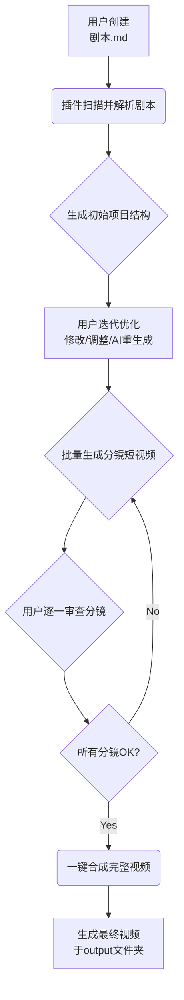

Vibe Video 插件的核心在于构建一个**高度结构化、可完全由用户掌控**的视频制作工具。

### 📁 项目结构与初始化
插件激活后，会基于用户的 `剧本.md` 文件，在工作区根目录生成一个标准化的项目结构。这种纯文本和文件系统的组织方式，天然支持版本控制（如Git），也让所有中间产物对用户完全透明。

```
MyVideoProject/                 # 项目根目录
├── 剧本.md                     # 用户提供的核心脚本
├── .vv-project.json           # 项目配置文件（如视频尺寸、AI模型偏好等）
├── assets/                    # 资源文件夹
│   ├── subjects/              # 主体（如角色、产品图等）
│   ├── styles/                # 视觉风格参考图/描述
│   ├── storyboards/           # 分镜脚本与初始帧
│   ├── audio/                 # 背景音乐与音效
│   └── clips/                 # 生成的5秒分段视频
└── output/                    # 最终合成视频
```

### 🔄 核心工作流
下面的流程图清晰地展示了从剧本到成片的完整操作闭环，它体现了“生成-编辑-再生成”的迭代式创作理念。

这个工作流的核心优势在于，它将AI的不稳定性转化为可控的生产步骤。用户可以在任何一个环节进行干预和调整，就像调试代码一样精细地打磨每个视频片段。

### 💡 与VS Code深度集成
为了实现“无缝衔接”，插件应充分利用VS Code的原生能力：

- **命令面板（Ctrl+Shift+P）为中心**：所有功能都通过命令调用，例如 `Vibe Video: Initialize Project`、`Vibe Video: Generate Storyboard`、`Vibe Video: Render All Clips`。
- **丰富的界面元素**：
    - **侧边栏视图**：提供一个“Vibe Video资源管理器”，以树形结构清晰展示生成的所有资源文件（分镜、音频、视频片段），支持点击预览。
    - **状态栏信息**：显示当前项目状态，如“分镜生成中...”或“就绪，可合成”。
    - **自定义Webview**：用于预览视频片段、展示分镜画布或提供更复杂的AI设置界面。
- **上下文菜单**：在资源管理器的文件上右键，可快速选择“使用AI重新生成此分镜”。
- **进度通知**：使用VS Code原生的进度条和通知系统，让用户清晰了解耗时操作（如视频生成）的状态。

### 🤖 AI能力与配置
你提到的“允许用户直接使用第三方API”是关键，这要求插件设计上足够开放和灵活。

- **AI服务抽象层**：插件核心应设计一个统一的AI服务接口，具体的实现（如调用OpenAI的Sora、谷歌的Imagen等）作为可配置的“供应商”。
- **配置文件管理**：在 `.vv-project.json` 或VS Code的设置中，允许用户配置自己的AI API密钥和端点。例如：
  ```json
  "vibevideo.aiProviders": {
    "openai": { "apiKey": "your_key_here" },
    "google": { "apiKey": "your_key_here" }
  }
  ```
- **提示词管理**：插件可以为每种生成任务（分镜、视频、音频）提供基础提示词模板，并允许用户在工作区创建 `.vv-prompts` 文件夹来自定义和覆盖这些模板，实现更精细的控制。

### 🚀 实施路线图建议
为了快速验证想法，你可以考虑分阶段发布：

1.  **MVP（最小可行产品）**：实现最核心链路。支持读取 `剧本.md`，生成基础项目结构，并能通过配置的AI API批量生成分镜视频并一键合成。
2.  **迭代优化**：增加高级功能。如分镜视频的单独重新生成、更丰富的AI供应商支持、背景音乐生成与同步、更直观的预览和编辑界面等。
3.  **生态扩展**：考虑引入模板市场（分享优秀的剧本模板和风格预设）、团队协作功能等。
