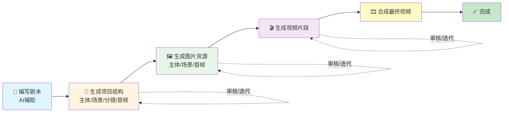

# Vibe Video 使用教程

**像写代码一样制作视频**

---

## 📋 目录

1. [简介](#简介)
2. [快速开始](#快速开始)
3. [分镜脚本规范](#分镜脚本规范)
4. [核心功能](#核心功能)
5. [常见问题](#常见问题)

---

## 简介

Vibe Video 是一个 VS Code 扩展，让您能够**像写代码一样制作视频**：

- 📝 **用 Markdown 写剧本**
- 🤖 **AI 生成分镜结构**
- 🎬 **批量生成视频片段**
- ✅ **迭代优化**

### 工作流程

**文本流程图：**
```
编写剧本 → AI生成项目结构 → 生成图片资源 → 生成视频片段 → 合成最终视频 → 完成
     ↑                                                                      ↓
     └────────────────────────────── 审核/迭代 ←──────────────────────────┘
```

**可视化流程图：**


---

## 快速开始

### 1. 环境准备

请参考 **[编辑器安装指南](other/editor-setup.md)** 完成编辑器环境配置。

### 2. 配置 API Key

Vibe Video 需要配置 AI 服务商的 API Key：

1. **获取 API Key**
   - **通义万相（首推推荐）**：访问 [DashScope 控制台](https://bailian.console.aliyun.com/)
     - ✅ **优势**：限制较少，功能完整，适合大多数使用场景
     - ✅ **支持**：真实人物、版权角色、多种尺寸配置
   - OpenAI Sora：访问 [OpenAI Platform](https://platform.openai.com/api-keys)
     - ⚠️ **注意**：存在较多使用限制（详见下方"常见问题"）
   - Replicate：访问 [Replicate 官网](https://replicate.com/)
   - Google Gemini：访问 [Google AI Studio](https://makersuite.google.com/app/apikey)

2. **配置方式**
   - `Ctrl+,` → 搜索 `vibevideo` → 设置 Provider 和 API Key
   - 或 `Ctrl+Shift+P` → `Vibe Video: Configure Video AI`

> 💡 **推荐**：首次使用建议选择**通义万相**，因为它限制更少、功能更完整。Sora 虽然功能强大，但在内容生成和用户权限上有较多限制。

### 3. 创建项目

1. 创建文件夹并打开：`File → Open Folder`
2. 初始化项目：`Ctrl+Shift+P` → `Vibe Video: Initialize Project`

项目结构：
```
MyVideoProject/
├── 剧本.md              # 您的剧本
├── subjects/            # 主体/角色
├── scenes/              # 场景
├── storyboards/         # 分镜脚本
├── first-frames/        # 首帧
├── video-clip/          # 视频片段
├── output/              # 最终合成视频
│   └── final.mp4
└── ...
```

### 4. 编写剧本

编辑 `剧本.md`：

```markdown
# 我的视频

## 场景 1：开场

主角走在城市街道上，微笑着向镜头挥手。

## 场景 2：展示

主角走进咖啡店，享受美好时光。
```

### 5. AI 生成项目结构

使用 AI 助手（参考 [编辑器安装指南](other/editor-setup.md)）生成项目结构。

在 AI 聊天窗口中输入：
```
根据剧本.md 生成完整的项目结构，包括：
1. 提取所有主体（角色），保存到 subjects/ 目录
2. 提取所有场景，保存到 scenes/ 目录
3. 将场景拆分成 5秒或10秒的分镜
4. 为每个分镜生成详细脚本，保存到 storyboards/ 目录
5. 为每个分镜生成首帧描述，保存到 first-frames/ 目录
```

### 6. 生成资源

批量生成：
- `Vibe Video: Generate All Subjects` - 生成主体图片
- `Vibe Video: Generate All Scenes` - 生成场景图片
- `Vibe Video: Generate First Frames` - 生成首帧图片
- `Vibe Video: Generate All Videos` - 生成视频

或右键点击资源选择生成命令。

### 6.1 参考图驱动工作流（推荐）

当你基于现有图片素材（例如客户提供的人物/场景照片）创作时，遵循以下流程可确保生成结果与参考图保持一致。

#### 保存参考图
- **侧边栏 `📸 参考图` 分组**：点击分组右侧 `+` 按钮或将图片拖入此分组，文件会保存到 `ref-img/`
- **命令面板**：`Ctrl+Shift+P` → `Vibe Video: 添加参考图`，支持一次选择多张图片
- **手动保存**：右键图片 → 另存为 → 保存到 `ref-img/` 目录

> ⚠️ 如果在聊天中粘贴了图片，AI 无法自动写入磁盘，请提醒用户先通过上述任意方式保存，再继续后续步骤。

#### 在 Markdown 中引用参考图
- **主体（subjects/）**：
  ```markdown
  # 主角
  
  - **参考图**: ref-img/hero-a.jpg
  
  外观描述...
  ```
  多张图片用逗号分隔：`- **参考图**: ref-img/hero-a.jpg, ref-img/hero-b.jpg`
- **场景（scenes/）**：
  ```markdown
  # 城市夜景
  
  - **参考图**: ref-img/city-01.jpg
  
  描述环境/光线/布局...
  ```
  场景描述中务必写明“只保留背景，不要人物/主体”，避免参考图中的人物被带入。

#### 自动获得的一致性
- 主体/场景写入 `参考图` 字段后，生成命令会自动切换为多图合成（`composeMultipleImages`），直接基于参考图进行重绘
- 首帧生成会复用主体图片，视频生成也会复用首帧，从而形成「参考图 → 主体 → 首帧 → 视频」的闭环

### 6.2 RunningHub 多角度首帧生成（高级功能）

当你已经生成了首帧图片，想要快速生成多个角度的候选图时，可以使用 RunningHub 工作流功能。

#### 配置 RunningHub

1. **创建 RunningHub 工作流**
   - 首先需要在 RunningHub 平台创建一个多角度首帧生成工作流
   - 详细步骤请参考：[RunningHub 工作流创建指南](runninghub-workflow-guide.md)
   - 工作流需要包含：图片输入节点（LoadImage）、提示词编码节点（TextEncodeQwenImageEditPlus）、模型加载、采样器、图片保存等节点

2. **获取 API Key**
   - 登录 [RunningHub 平台](https://www.runninghub.cn)
   - 点击右上角头像 → API 控制台
   - 复制你的 API Key

3. **在 VS Code 中配置 API Key**
   - `Ctrl+,` → 搜索 `vibevideo.runninghub`
   - 填写以下配置：
     - `vibevideo.runninghub.apiKey`: 你的 RunningHub API Key
     - `vibevideo.runninghub.baseUrl`: （可选）API 基础 URL，留空使用默认值

4. **配置工作流参数**
   - 在工作区根目录创建 `.vibevideo/` 目录（如果不存在）
   - 复制 `templates/runninghub-workflows.example.json` 到 `.vibevideo/runninghub-workflows.json`
   - 编辑配置文件，填入你创建的工作流信息：
     - `workflowId`: 从工作流页面 URL 获取（例如：`https://www.runninghub.cn/workflow/1904136902449209346` → ID 为 `1904136902449209346`）
     - `imageNodeId`: LoadImage 节点的编号（从工作流 JSON 中查找）
     - `promptNodeId`: TextEncodeQwenImageEditPlus 节点的编号（从工作流 JSON 中查找）
   - 可以为不同角度配置不同的工作流（在 `angleWorkflows` 中为每个角度单独配置）

> 💡 **提示**：
> - 如果工作区没有自定义配置文件，扩展会使用内置的默认配置（需要先创建对应的工作流）
> - 工作流配置优先级：工作区配置文件 > 扩展默认配置
> - 角度配置优先级：`angleWorkflows[角度ID]` > `defaultWorkflow`
> - 详细的工作流创建步骤请参考：[RunningHub 工作流创建指南](runninghub-workflow-guide.md)

#### 使用多角度生成

1. **生成基础角度**
   - 在资源树中，右键已生成的首帧图片
   - 选择以下任一角度：
     - `生成俯视角度`
     - `生成仰视角度`
     - `生成广角`
     - `生成特写`

2. **生成高级角度**
   - 右键首帧图片 → `更多角度选项`
   - 在弹出的菜单中选择：
     - 左侧特写
     - 右侧特写
     - 过肩镜头
     - 低角度
     - 高角度
     - 倾斜镜头

3. **查看结果**
   - 生成完成后，多角度图片会保存到 `first-frames/` 目录
   - 命名格式：`<原首帧名>-angle-<角度ID>.png`
   - 如果工作流返回多张图片，其余图片会使用 `.o-1`, `.o-2` 等后缀
   - 使用"选中/不选中"命令选择最终使用的首帧版本

> 💡 **提示**：多角度生成基于已有首帧图片，保持整体构图一致性，适合快速探索不同视角的候选方案。

### 7. 合成最终视频 ⭐

生成所有视频片段后，将它们合成为最终视频：

- `Vibe Video: Compose Video` - 将所有视频片段合成为最终视频

最终视频将保存到 `output/final.mp4`。

**注意**：视频合成需要 FFmpeg。扩展会自动检测并引导您安装 FFmpeg（如果需要）。

---

## 分镜脚本规范

### 标准格式

```markdown
# 场景标题

- **时长**: 5秒 或 10秒（**只能是5秒或10秒**）
- **主体**: 角色1, 角色2（可选）
- **场景**: 场景名（可选）
- **参考图**: first-frames/xxx-first-frame.png（可选）
- **首帧**: first-frames/xxx-first-frame.png（可选）
- **尾帧**: first-frames/xxx-last-frame.png（可选）

**提示词**：一段融合的完整描述，包含视频内容、声音、美学和风格。
```

### 字段说明

- **时长**（必需）：只能是 5秒 或 10秒
- **主体**（可选）：角色列表，用于确保角色外观一致
- **场景**（可选）：场景名称，用于复用场景资源
- **参考图**（推荐）：使用参考图可以让生成更可控
- **首帧**（可选）：用于图生视频
- **尾帧**（可选）：用于首尾帧生视频
- **提示词**（必需）：**必须是一段融合的完整描述，不能分条列出**

### 提示词示例

❌ **错误**：
```markdown
**视频提示词**：镜头推进
**声音提示词**：背景音乐轻松
**美学控制**：阳光明亮
```

✅ **正确**：
```markdown
**提示词**：镜头缓慢推进，主角从远处走来，微笑着向镜头挥手，背景音乐轻松愉快，阳光透过高楼洒下，营造出温暖明亮的氛围。
```

### 完整示例

```markdown
# 开场镜头

- **时长**: 5秒
- **主体**: 主角
- **场景**: 城市街道
- **首帧**: first-frames/01-opening-first-frame.png

**提示词**：镜头缓慢推进，展现城市街道的繁华景象，主角从远处走来，微笑着向镜头挥手，背景音乐轻松愉快，阳光透过高楼洒下，营造出温暖明亮的氛围，画面采用电影质感，色彩饱和度高。
```

---

## 核心功能

### 项目管理

- **初始化项目**：`Vibe Video: Initialize Project`
- **项目统计**：`Vibe Video: Show Project Stats`
- **质量检查**：`Vibe Video: Check Storyboards Quality`

### 资源生成

#### 主体生成
- 用途：确保角色外观一致
- 特点：白色背景，便于合成
- 命令：`Vibe Video: Generate All Subjects`

#### 场景生成
- 用途：创建背景环境
- 特点：可以复用；系统会强制只生成纯背景，自动忽略参考图中的人物或主体
- 命令：`Vibe Video: Generate All Scenes`

#### 首帧生成
- 文生图：`Vibe Video: Generate First Frames`
- 合成：`Vibe Video: Compose All First Frames`（使用主体+场景）

#### 视频生成
- **图生视频**（推荐）：使用首帧图片 + 提示词
- **文生视频**：仅使用文本提示词
- **首尾帧生视频**（高级）：使用首帧 + 尾帧图片

#### 视频合成 ⭐
- **合成视频**：`Vibe Video: Compose Video` - 将所有视频片段合并为最终视频
- 使用 FFmpeg 按分镜顺序合并片段
- 输出：`output/final.mp4`
- 自动处理缺失片段（提示用户并允许继续）

### 配置管理

- 查看配置：`Vibe Video: Show Current Config`
- 修改配置：`Ctrl+,` → 搜索 `vibevideo`

主要配置项：
- `vibevideo.provider`：AI 服务商（默认：`tongyi-wanxiang`，**推荐**）
  - 选项：`tongyi-wanxiang`（首推）、`sora`（有较多限制，详见常见问题）、`replicate`、`google`
- `vibevideo.dashscope.apiKey`：DashScope API Key（用于通义万相）
- `vibevideo.sora.apiKey`：OpenAI API Key（用于 OpenAI Sora）
- `vibevideo.sora.baseUrl`：OpenAI API 基础 URL（可选，默认：`https://api.openai.com/v1`）
- `vibevideo.replicate.apiKey`：Replicate API Token（用于 Replicate）
- `vibevideo.google.apiKey`：Google API Key（用于 Google Gemini）
- `vibevideo.video.resolution`：视频分辨率（默认：`720P`）
  - 选项：`480P`、`720P`、`1080P`
- `vibevideo.video.aspectRatio`：视频长宽比（默认：`16:9`）
  - 选项：`16:9`（横屏）、`4:3`（横屏）、`1:1`（正方形）、`3:4`（竖屏）、`9:16`（竖屏）
  - **注意**：长宽比会与分辨率结合使用，确定最终的视频尺寸
- `vibevideo.image.size`：图片尺寸（统一设置，默认：`1280*720`）
  - 格式：`宽度*高度`，例如：`1280*720`、`1920*1080`、`1024*1024`
  - 适用于所有图片生成（主体、场景、首帧）
- `vibevideo.image.subjectSize`：主体图片尺寸（可选，留空则使用统一图片尺寸）
- `vibevideo.image.sceneSize`：场景图片尺寸（可选，留空则使用统一图片尺寸）
- `vibevideo.image.firstFrameSize`：首帧图片尺寸（可选，留空则使用统一图片尺寸）
- `vibevideo.runninghub.apiKey`：RunningHub API Key（用于多角度首帧生成等高级工作流）
- `vibevideo.runninghub.baseUrl`：RunningHub API 基础 URL（可选，默认：`https://www.runninghub.cn`）

> 💡 **注意**：工作流配置（workflowId、nodeId 等）已硬编码在代码中，用户只需配置 API Key 即可使用。

**注意**：不同 Provider 的图片生成会使用不同的 API 服务：
- **通义万相**：图片生成使用通义千问 API（`wan2.5-t2i-preview`、`qwen-image-edit-plus`）
  - 支持任意尺寸配置（如 `1280*720`、`1920*1080`）
- **OpenAI Sora**：图片生成使用 OpenAI API（`gpt-image-1` 或 `dall-e-3`）
  - **图片尺寸限制**：Sora 只支持三个固定尺寸
    - `1024x1024`（1:1 正方形）
    - `1792x1024`（16:9 横屏）
    - `1024x1792`（9:16 竖屏）
  - **自动映射**：系统会根据您配置的图片尺寸（如 `1280*720`）自动映射到最接近的 Sora 支持尺寸
    - `1280*720`（16:9）→ `1792x1024`（16:9 横屏）
    - `720*1280`（9:16）→ `1024x1792`（9:16 竖屏）
    - `1024*1024`（1:1）→ `1024x1024`（1:1 正方形）
  - **视频尺寸**：Sora 视频生成支持以下尺寸
    - `720x1280`（9:16 竖屏）
    - `1280x720`（16:9 横屏）
    - `1024x1792`（9:16 竖屏高分辨率）
    - `1792x1024`（16:9 横屏高分辨率）
  - **视频尺寸选择**：系统会根据您配置的分辨率（如 `1080P`）和长宽比（如 `16:9`）自动选择最合适的视频尺寸
    - `1080P + 16:9` → `1792x1024`（横屏高分辨率）
    - `1080P + 9:16` → `1024x1792`（竖屏高分辨率）
    - `720P + 16:9` → `1280x720`（横屏标准分辨率）
    - `720P + 9:16` → `720x1280`（竖屏标准分辨率）
- **Replicate**：使用 Replicate 平台的图片生成模型
- **Google Gemini**：使用 Google Gemini 图片生成模型

---

## 常见问题

**Q: 分镜时长可以是其他值吗？**  
A: 不可以。只能是 **5秒 或 10秒**。

**Q: 提示词可以分条列出吗？**  
A: 不可以。必须是一段融合的完整描述。

**Q: 如何引用参考图？**  
A: 在分镜脚本中使用相对路径：`- **参考图**: ref-img/product.jpg`

**Q: 如何从参考图开始创建完整项目？**  
A: 流程如下：1）通过侧边栏/命令面板/手动方式把图片保存到 `ref-img/`; 2）在 `subjects/` 和 `scenes/` Markdown 中添加 `- **参考图**: ref-img/xxx.jpg` 字段，并在场景描述里注明“只保留背景”; 3）运行主体/场景/首帧/视频生成命令。系统会自动切换到多图合成，保证人物与参考图一致，场景也只保留环境。

**Q: 如何使用 RunningHub 生成多角度首帧？**  
A: 1）在 VS Code 设置中配置 RunningHub API Key；2）右键已生成的首帧图片，选择角度类型（俯视、仰视、广角、特写等）或点击"更多角度选项"选择高级角度。默认使用内置工作流配置，无需额外配置。

**Q: 如何修改 RunningHub 工作流配置？**  
A: 在工作区根目录创建 `.vibevideo/runninghub-workflows.json` 文件（参考 `templates/runninghub-workflows.example.json`），编辑配置文件中的 `workflowId`、`imageNodeId`、`promptNodeId` 等参数。可以为不同角度配置不同的工作流。

**Q: 生成失败怎么办？**  
A: 检查 API Key、网络连接、API 额度，查看 VS Code 输出面板的错误信息。对于 RunningHub 工作流，请确认 nodeId 和 fieldName 配置正确。

**Q: 可以使用本地部署的模型吗？**  
A: 可以。配置 `vibevideo.dashscope.baseUrl` 或 `vibevideo.sora.baseUrl` 为本地服务地址。

**Q: 如何将所有视频片段合成为最终视频？**  
A: 使用 `Vibe Video: Compose Video` 命令。需要 FFmpeg - 扩展会在需要时引导您安装。

**Q: 如果 FFmpeg 未安装怎么办？**  
A: 扩展会自动检测 FFmpeg 并引导您安装。您可以从系统 PATH 安装 FFmpeg 或通过 npm 包安装。

**Q: 使用 Sora Provider 时，为什么图片尺寸和配置的不一样？**  
A: Sora 的图片生成 API 只支持三个固定尺寸（`1024x1024`、`1792x1024`、`1024x1792`）。系统会根据您配置的图片尺寸（如 `1280*720`）自动映射到最接近的 Sora 支持尺寸，保持长宽比一致。例如：
- 配置 `1280*720`（16:9）→ 映射到 `1792x1024`（16:9 横屏）
- 配置 `720*1280`（9:16）→ 映射到 `1024x1792`（9:16 竖屏）

**Q: 使用 Sora Provider 时，如何设置视频的横屏/竖屏？**  
A: 通过配置 `vibevideo.video.aspectRatio` 来设置：
- `16:9` 或 `4:3` → 横屏视频
- `9:16` 或 `3:4` → 竖屏视频
- `1:1` → 正方形视频

系统会根据您配置的分辨率（如 `1080P`）和长宽比（如 `16:9`）自动选择最合适的视频尺寸。

**Q: 图片尺寸配置和视频长宽比配置有什么区别？**  
A: 
- **图片尺寸配置**（`vibevideo.image.size`）：用于生成图片资源（主体、场景、首帧），格式为 `宽度*高度`（如 `1280*720`）
- **视频长宽比配置**（`vibevideo.video.aspectRatio`）：用于生成视频，格式为比例（如 `16:9`），会与分辨率配置结合使用

两者可以独立配置，例如：图片使用 `1280*720`，视频使用 `1080P + 16:9`。

**Q: 为什么推荐使用通义万相而不是 Sora？**  
A: 通义万相在使用限制上更宽松，功能更完整。Sora 虽然功能强大，但存在以下限制：

⚠️ **Sora 的内容与使用限制**：

1. **人物与肖像限制**
   - 不支持使用包含**真实人物的图像**来生成视频
   - 出于肖像权和防止虚假信息滥用的考虑
   - 对于历史人物，OpenAI 会应遗产管理方的请求采取限制措施（例如已暂停生成马丁·路德·金形象视频的功能）

2. **版权内容管控**
   - 针对知名版权内容（如迪士尼、宝可梦等），Sora 的版权政策已从宽松的"默认允许"调整为更严格的"主动同意（Opt-in）"模式
   - 除非版权方明确授权，否则模型会**拒绝生成相关角色**

3. **用户资格与内容安全**
   - 仅对**18岁及以上的用户**开放
   - 禁止生成非法、暴力、色情或仇恨等有害内容
   - 设有自动审核机制

**建议**：如果您需要生成包含真实人物、知名版权角色，或需要更大的创作自由度，强烈推荐使用**通义万相**。

---

## 需要帮助？

- 📖 [编辑器安装指南](other/editor-setup.md)
- 📚 [API Key 获取指南](API-KEY-获取指南.md)
- 📧 邮箱：cici_yiyi@qq.com
- 💬 微信：扫码添加（见 README）

**享受用 Vibe Video 制作视频的乐趣！** 🎬
