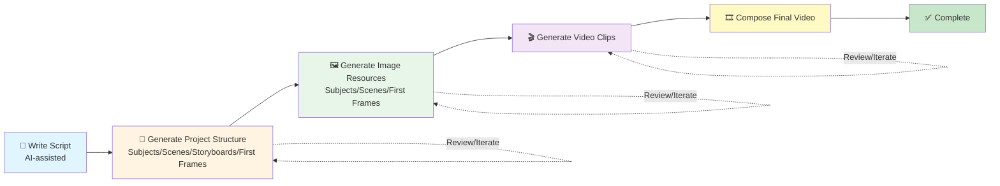

# Vibe Video Tutorial

**Create Videos Like Writing Code**

---

## 📋 Table of Contents

1. [Introduction](#introduction)
2. [Quick Start](#quick-start)
3. [Storyboard Specification](#storyboard-specification)
4. [Core Features](#core-features)
5. [FAQ](#faq)

---

## Introduction

Vibe Video is a VS Code extension that lets you **create videos like writing code**:

- 📝 **Write scripts in Markdown**
- 🤖 **AI generates storyboard structure**
- 🎬 **Batch generate video clips**
- ✅ **Iterate and optimize**

### Workflow

**Text Flowchart:**
```
Write Script → AI Generates Project Structure → Generate Images → Generate Videos → Compose Final Video → Complete
     ↑                                                                                                          ↓
     └────────────────────────────────── Review/Iterate ←─────────────────────────────────────────────────────┘
```

**Visual Flowchart:**


---

## Quick Start

### 1. Environment Setup

Please refer to the **[Editor Setup Guide](other/editor-setup_EN.md)** to complete editor environment configuration.

### 2. Configure API Key

Vibe Video requires an AI service provider API Key:

1. **Get API Key**
   - Tongyi Wanxiang (Recommended): Visit [DashScope Console](https://bailian.console.aliyun.com/)
   - OpenAI Sora: Visit [OpenAI Platform](https://platform.openai.com/api-keys)
   - Replicate: Visit [Replicate](https://replicate.com/)
   - Google Gemini: Visit [Google AI Studio](https://makersuite.google.com/app/apikey)

2. **Configure**
   - `Ctrl+,` → Search `vibevideo` → Set Provider and API Key
   - Or `Ctrl+Shift+P` → `Vibe Video: Configure Video AI`

### 3. Create Project

1. Create folder and open: `File → Open Folder`
2. Initialize project: `Ctrl+Shift+P` → `Vibe Video: Initialize Project`

Project structure:
```
MyVideoProject/
├── Script.md            # Your script
├── subjects/            # Characters/Subjects
├── scenes/              # Scenes
├── storyboards/         # Storyboard scripts
├── first-frames/        # First frames
├── video-clip/          # Video clips
├── output/              # Final composed video
│   └── final.mp4
└── ...
```

### 4. Write Script

Edit `Script.md`:

```markdown
# My Video

## Scene 1: Opening

The main character walks on a city street, smiling and waving at the camera.

## Scene 2: Showcase

The main character enters a coffee shop and enjoys a good time.
```

### 5. AI Generate Project Structure

Use AI assistant (see [Editor Setup Guide](other/editor-setup_EN.md)) to generate project structure.

Enter in AI chat window:
```
Generate complete project structure based on Script.md, including:
1. Extract all subjects (characters), save to subjects/ directory
2. Extract all scenes, save to scenes/ directory
3. Split scenes into 5s or 10s storyboards
4. Generate detailed scripts for each storyboard, save to storyboards/ directory
5. Generate first frame descriptions for each storyboard, save to first-frames/ directory
```

### 6. Generate Resources

Batch generate:
- `Vibe Video: Generate All Subjects` - Generate subject images
- `Vibe Video: Generate All Scenes` - Generate scene images
- `Vibe Video: Generate First Frames` - Generate first frame images
- `Vibe Video: Generate All Videos` - Generate videos

Or right-click resources to select generate commands.

### 7. Compose Final Video ⭐

After generating all video clips, compose them into a final video:

- `Vibe Video: Compose Video` - Compose all video clips into final video

The final video will be saved to `output/final.mp4`.

**Note**: FFmpeg is required for video composition. The extension will automatically detect and guide you to install FFmpeg if needed.

---

## Storyboard Specification

### Standard Format

```markdown
# Scene Title

- **Duration**: 5s or 10s (**Only 5s or 10s**)
- **Subject**: character1, character2 (optional)
- **Scene**: scene name (optional)
- **Reference**: first-frames/xxx-first-frame.png (optional)
- **First Frame**: first-frames/xxx-first-frame.png (optional)
- **Last Frame**: first-frames/xxx-last-frame.png (optional)

**Prompt**: A complete integrated description containing video content, sound, aesthetics, and style.
```

### Field Descriptions

- **Duration** (Required): Only 5s or 10s
- **Subject** (Optional): Character list, ensures consistent character appearance
- **Scene** (Optional): Scene name, for reusing scene resources
- **Reference** (Recommended): Using reference images makes generation more controllable
- **First Frame** (Optional): For image-to-video generation
- **Last Frame** (Optional): For first-last frame video generation
- **Prompt** (Required): **Must be a complete integrated description, cannot be listed separately**

### Prompt Examples

❌ **Wrong**:
```markdown
**Video Prompt**: Camera pushes forward
**Sound Prompt**: Light background music
**Aesthetic Control**: Bright sunlight
```

✅ **Correct**:
```markdown
**Prompt**: Camera slowly pushes forward, the main character approaches from afar, smiling and waving at the camera, light and cheerful background music, sunlight filters through tall buildings, creating a warm and bright atmosphere.
```

### Complete Example

```markdown
# Opening Shot

- **Duration**: 5s
- **Subject**: Main Character
- **Scene**: City Street
- **First Frame**: first-frames/01-opening-first-frame.png

**Prompt**: Camera slowly pushes forward, showcasing the bustling city street scene, the main character approaches from afar, smiling and waving at the camera, light and cheerful background music, sunlight filters through tall buildings, creating a warm and bright atmosphere, cinematic quality visuals with high color saturation.
```

---

## Core Features

### Project Management

- **Initialize Project**: `Vibe Video: Initialize Project`
- **Project Stats**: `Vibe Video: Show Project Stats`
- **Quality Check**: `Vibe Video: Check Storyboards Quality`

### Resource Generation

#### Subject Generation
- Purpose: Ensure consistent character appearance
- Features: White background for easy compositing
- Command: `Vibe Video: Generate All Subjects`

#### Scene Generation
- Purpose: Create background environments
- Features: Reusable
- Command: `Vibe Video: Generate All Scenes`

#### First Frame Generation
- Text-to-Image: `Vibe Video: Generate First Frames`
- Composition: `Vibe Video: Compose All First Frames` (using subject + scene)

#### Video Generation
- **Image-to-Video** (Recommended): Use first frame image + prompt
- **Text-to-Video**: Only use text prompt
- **First-Last Frame Video** (Advanced): Use first frame + last frame images

#### Video Composition ⭐
- **Compose Video**: `Vibe Video: Compose Video` - Merge all video clips into final video
- Uses FFmpeg to combine clips in storyboard order
- Output: `output/final.mp4`
- Automatically handles missing clips (prompts user and allows continuation)

### Configuration Management

- View Config: `Vibe Video: Show Current Config`
- Modify Config: `Ctrl+,` → Search `vibevideo`

Main Configuration Items:
- `vibevideo.provider`: AI Service Provider (default: `tongyi-wanxiang`)
  - Options: `tongyi-wanxiang`, `sora`, `replicate`, `google`
- `vibevideo.dashscope.apiKey`: DashScope API Key (for Tongyi Wanxiang)
- `vibevideo.sora.apiKey`: OpenAI API Key (for OpenAI Sora)
- `vibevideo.sora.baseUrl`: OpenAI API Base URL (optional, default: `https://api.openai.com/v1`)
- `vibevideo.replicate.apiKey`: Replicate API Token (for Replicate)
- `vibevideo.google.apiKey`: Google API Key (for Google Gemini)
- `vibevideo.video.resolution`: Video Resolution (default: `720P`)
  - Options: `480P`, `720P`, `1080P`
- `vibevideo.video.aspectRatio`: Video Aspect Ratio (default: `16:9`)
  - Options: `16:9` (landscape), `4:3` (landscape), `1:1` (square), `3:4` (portrait), `9:16` (portrait)
  - **Note**: Aspect ratio is combined with resolution to determine the final video size
- `vibevideo.image.size`: Image Size (unified setting, default: `1280*720`)
  - Format: `width*height`, e.g., `1280*720`, `1920*1080`, `1024*1024`
  - Applies to all image generation (subjects, scenes, first frames)
- `vibevideo.image.subjectSize`: Subject Image Size (optional, empty to use unified image size)
- `vibevideo.image.sceneSize`: Scene Image Size (optional, empty to use unified image size)
- `vibevideo.image.firstFrameSize`: First Frame Image Size (optional, empty to use unified image size)

**Note**: Different providers use different APIs for image generation:
- **Tongyi Wanxiang**: Uses Tongyi Qwen API for image generation (`wan2.5-t2i-preview`, `qwen-image-edit-plus`)
  - Supports arbitrary size configuration (e.g., `1280*720`, `1920*1080`)
- **OpenAI Sora**: Uses OpenAI API for image generation (`gpt-image-1` or `dall-e-3`)
  - **Image Size Limitations**: Sora only supports three fixed sizes
    - `1024x1024` (1:1 square)
    - `1792x1024` (16:9 landscape)
    - `1024x1792` (9:16 portrait)
  - **Auto Mapping**: The system automatically maps your configured image size (e.g., `1280*720`) to the closest supported Sora size
    - `1280*720` (16:9) → `1792x1024` (16:9 landscape)
    - `720*1280` (9:16) → `1024x1792` (9:16 portrait)
    - `1024*1024` (1:1) → `1024x1024` (1:1 square)
  - **Video Sizes**: Sora video generation supports the following sizes
    - `720x1280` (9:16 portrait)
    - `1280x720` (16:9 landscape)
    - `1024x1792` (9:16 portrait high resolution)
    - `1792x1024` (16:9 landscape high resolution)
  - **Video Size Selection**: The system automatically selects the most appropriate video size based on your configured resolution (e.g., `1080P`) and aspect ratio (e.g., `16:9`)
    - `1080P + 16:9` → `1792x1024` (landscape high resolution)
    - `1080P + 9:16` → `1024x1792` (portrait high resolution)
    - `720P + 16:9` → `1280x720` (landscape standard resolution)
    - `720P + 9:16` → `720x1280` (portrait standard resolution)
- **Replicate**: Uses Replicate platform image generation models
- **Google Gemini**: Uses Google Gemini image generation models

---

## FAQ

**Q: Can storyboard duration be other values?**  
A: No. Only **5s or 10s**.

**Q: Can prompts be listed separately?**  
A: No. Must be a complete integrated description.

**Q: How to reference images?**  
A: Use relative paths in storyboard script: `- **Reference**: ref-img/product.jpg`

**Q: What to do if generation fails?**  
A: Check API Key, network connection, API quota, and view error messages in VS Code output panel.

**Q: Can I use locally deployed models?**  
A: Yes. Configure `vibevideo.dashscope.baseUrl` or `vibevideo.sora.baseUrl` to your local service address.

**Q: How do I compose all video clips into a final video?**  
A: Use `Vibe Video: Compose Video` command. FFmpeg is required - the extension will guide you to install it if needed.

**Q: What if FFmpeg is not installed?**  
A: The extension will automatically detect FFmpeg and guide you to install it. You can install FFmpeg from system PATH or via npm package.

**Q: When using Sora Provider, why is the image size different from my configuration?**  
A: Sora's image generation API only supports three fixed sizes (`1024x1024`, `1792x1024`, `1024x1792`). The system automatically maps your configured image size (e.g., `1280*720`) to the closest supported Sora size while maintaining the aspect ratio. For example:
- Configured `1280*720` (16:9) → Mapped to `1792x1024` (16:9 landscape)
- Configured `720*1280` (9:16) → Mapped to `1024x1792` (9:16 portrait)

**Q: When using Sora Provider, how do I set landscape/portrait for videos?**  
A: Configure `vibevideo.video.aspectRatio`:
- `16:9` or `4:3` → Landscape video
- `9:16` or `3:4` → Portrait video
- `1:1` → Square video

The system automatically selects the most appropriate video size based on your configured resolution (e.g., `1080P`) and aspect ratio (e.g., `16:9`).

**Q: What's the difference between image size configuration and video aspect ratio configuration?**  
A:
- **Image Size Configuration** (`vibevideo.image.size`): Used for generating image resources (subjects, scenes, first frames), format is `width*height` (e.g., `1280*720`)
- **Video Aspect Ratio Configuration** (`vibevideo.video.aspectRatio`): Used for generating videos, format is ratio (e.g., `16:9`), combined with resolution configuration

They can be configured independently. For example: images use `1280*720`, videos use `1080P + 16:9`.

---

## Need Help?

- 📖 [Editor Setup Guide](other/editor-setup_EN.md)
- 📚 [API Key Guide](API-KEY-Guide_EN.md)
- 📧 Email: cici_yiyi@qq.com
- 💬 WeChat: Scan QR code (see README)

**Enjoy creating videos with Vibe Video!** 🎬

