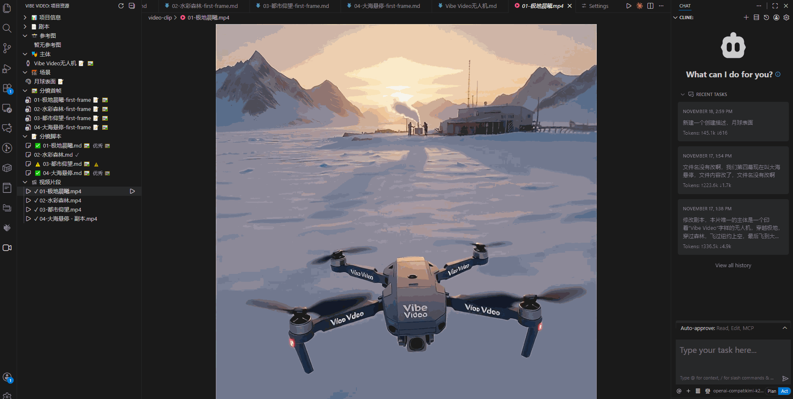
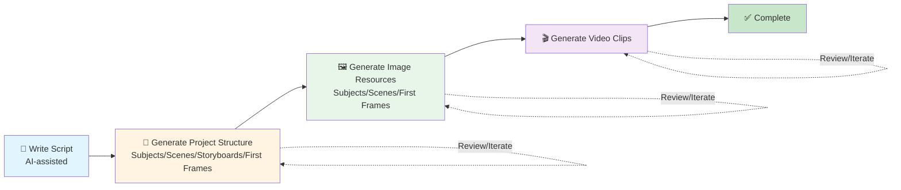

# Vibe Video

**Create Videos Like Writing Code**

[](https://marketplace.visualstudio.com/vscode)
[](https://opensource.org/licenses/MIT)
[](https://github.com/Cici2014/vibevideo)

**Language**: [English](README.md) | [Simplified Chinese](README_CN.md)

Vibe Video is a VS Code extension that lets you create videos like writing code: write scripts in Markdown, generate storyboards with AI, batch generate videos, and compose them with one click.



## ✨ Features

### 🚀 Lightweight Workflow
- Write scripts in Markdown (any format)
- Use Cursor AI to generate complete project structure with one click (subjects, scenes, storyboards, first frames)
- Standardized project structure, Git-friendly
- Fixed storyboard duration (5s/10s) for easy batch processing

### 🤖 Smart AI Integration
- Auto-generate `.cursorrules` to help AI understand project structure and workflow
- Subject library management for consistent character appearance
- Scene library management for reusable scene resources
- Image-to-video generation (higher quality, more controllable)
- Multiple AI Provider support:
  - **Tongyi Wanxiang API** (domestic service with excellent Chinese support, ✅ **Tested**, production ready)
  - **Replicate API** (supports multiple video generation models like Zeroscope, AnimateDiff, etc.) ⚠️ **Not Tested**
  - **Google Gemini API** (supports gemini-3-pro-image-preview, veo-3 models) ⚠️ **Not Tested**

### 📊 Visual Management
- Sidebar displays project resources (subjects, scenes, storyboards, first frames, videos)
- Quality checks and friendly suggestions
- Project statistics and progress tracking
- Right-click menu for quick single resource generation

### 🎬 Complete Workflow

Vibe Video's workflow is like writing code: **Write → Generate → Review → Iterate**.



**Core Philosophy**: The entire process can be iterated repeatedly, just like coding. Generating resources is like "compiling", and manual review is like "finding bugs". If it doesn't pass, you can iterate multiple times until satisfied.

## 💡 Design Philosophy: Lightweight to the Core

Vibe Video adopts a "just right" balanced design with the core philosophy of **lightweight to the core**.

### 🎯 Three-Layer Design Principles

#### 1️⃣ Lightweight Parts (Leverage Existing Tools)
- **Storyboard Script Generation**: Use Cursor AI / Copilot (provide context via `.cursorrules`)
  - ✅ AI programming tools are already powerful, we don't need to reinvent the wheel
  - ✅ The extension only provides context to help AI understand project structure
- **Project Organization**: Standardized file structure and naming conventions
- **Resource Browsing**: Simple sidebar view

#### 2️⃣ Necessary Complexity (Unavoidable)
- **Video Generation**: Must call specialized video AI APIs
  - ⚠️ Theoretically possible to let AI programming tools access video generation via MCP, but too expensive
  - ✅ Keep it simple: Single Provider + basic polling
  - ✅ Support image-to-video: Provide initial frame → higher quality, more controllable

#### 3️⃣ Optional Features
- **Video Composition**: Use ffmpeg (optional, doesn't affect core workflow)

### 🌟 Core Concepts

#### **Markdown > JSON**
- Storyboard scripts use **Markdown**, not JSON
- Intuitive and easy to read
- AI naturally understands, no complex validation needed
- Git-friendly, easy collaboration

#### **Content > Format**
- Don't obsess over format details
- Focus on teaching users to write good prompts
- Validation is auxiliary, not mandatory
- Loose parsing, strong error tolerance

#### **Convention Over Configuration**
- Make projects "self-explanatory" through standardized file structure
- AI can automatically understand project intent
- Reduce configuration, improve efficiency

#### **Leverage Existing AI Tools**
- Don't reinvent the wheel
- When users use Cursor, Copilot, Claude, etc., the extension provides context
- Extension is an assistant, not a controller

#### **Practicality First**
- Don't pursue perfect abstract design
- Focus on core user value (batch video generation)
- Fast iteration: 6 weeks instead of 3-4 months
- Friendly prompts, not strict errors

### 📊 Minimal Tech Stack

```
VS Code Extension
├── TypeScript 5.x
├── VS Code Extension API
├── Simple TreeView (resource browsing)
└── Optional: ffmpeg (video composition)

Configuration Files (for AI understanding)
├── .cursorrules / .clinerules
└── Standardized project structure
```

**Production Dependencies**: 
- Tongyi Wanxiang API (optional, default, ✅ **Tested**, production ready)
- Replicate API (optional, ⚠️ **Not Tested**)
- Google Gemini API (optional, ⚠️ **Not Tested**)

### 🎓 Why This Design?

- ✅ **No Over-Engineering**: Avoid complexity of heavy solutions
- ✅ **No Over-Simplification**: Ensure core functionality is usable
- ✅ **Fast Iteration**: Complete usable version in 6 weeks
- ✅ **User Control**: Users can manually edit any file, skip any step
- ✅ **Low Cost**: Leverage users' existing AI tool subscriptions

**Remember**: This is a lightweight tool. The core is to help users "organize" and "standardize", not "automate everything". Keeping it simple and focused is key to success.

## 🚀 Quick Start

### 1. Initialize Project
```
Ctrl+Shift+P → "Vibe Video: Initialize Project"
```
Or click "Initialize Project" in the left Vibe Video resource tree

### 2. Write Script
Edit `Script.md` and write your video script

### 3. Use AI to Generate Complete Project Structure
In Cursor AI Chat, enter:
```
Generate project based on Script.md
```

AI will automatically execute the following steps:
1. **Extract Subjects**: Extract main characters/subjects from the script, save to `subjects/` directory
2. **Extract Scenes**: Extract various scenes from the script, save to `scenes/` directory
3. **Split Storyboards**: Split scenes into 5s/10s storyboard units (**Storyboard duration can only be 5s or 10s**)
4. **Generate Storyboard Scripts**: Write detailed scripts for each storyboard, save to `storyboards/` directory
5. **Generate First Frame Descriptions**: Write first frame descriptions for each storyboard, save to `first-frames/` directory

### 4. Configure API (One-time) ⭐

**Method 1**: Use Command
```
Ctrl+Shift+P → "Vibe Video: Configure Video AI"
→ Click "Open Settings"
```

**Method 2**: Open Settings Directly (Recommended)
```
Ctrl+, → Search "vibevideo"
→ Select Provider (Tongyi Wanxiang, Replicate, or Google Gemini)
→ Enter API Key/Token
```

**Supported Providers:**
- **Tongyi Wanxiang**: Enter DashScope API Key (Recommended, ✅ **Tested**, Production Ready)
- **Replicate**: Enter Replicate API Token (get from https://replicate.com/account/api-tokens) ⚠️ **Not Tested**
- **Google Gemini**: Enter Google API Key (⚠️ **Not Tested**)

**⚠️ Testing Status Notice**:
- ✅ **Tested**: Tongyi Wanxiang has been fully tested, all features working normally, **strongly recommended for production**
- ❌ **Not Tested**: Other Providers are implemented but not tested with actual APIs

Configuration is automatically saved to VS Code settings

### 5. AI Models Used

Vibe Video uses the following AI models for different generation tasks:

#### 🤖 Tongyi Wanxiang (DashScope) - ✅ Tested, Production Ready

| Task Type | Model | Description | Testing Status |
|-----------|-------|-------------|---------------|
| **Text-to-Image** | `wan2.5-t2i-preview` | Generate images from text prompts (for subjects, scenes, first frames) | ✅ Tested |
| **Image-to-Image** | `wan2.5-i2i-preview` | Compose multiple images (for combining subjects + scenes) | ✅ Tested |
| **Text-to-Video** | `wan2.5-i2v-preview` | Generate videos directly from text prompts | ✅ Tested |
| **Image-to-Video** | `wan2.5-i2v-preview` | Generate videos from initial frame images | ✅ Tested |
| **First-Last Frame to Video** | `wan2.2-kf2v-flash` | Generate videos from first and last frame images (for precise control) | ✅ Tested |

#### 🌐 Replicate - ⚠️ Not Tested

| Task Type | Default Model | Description | Testing Status |
|-----------|--------------|-------------|---------------|
| **Text-to-Image** | `stability-ai/sdxl` | Generate images from text prompts | ❌ Not Tested |
| **Text-to-Video** | `anotherjesse/zeroscope-v2-xl` | Generate videos from text prompts | ❌ Not Tested |
| **Image-to-Video** | `anotherjesse/zeroscope-v2-xl` | Generate videos from initial frame images | ❌ Not Tested |

#### 🔷 Google Gemini - ⚠️ Not Tested

| Task Type | Default Model | Description | Testing Status |
|-----------|--------------|-------------|---------------|
| **Text-to-Image** | `gemini-3-pro-image-preview` | Generate images from text prompts | ❌ Not Tested |
| **Image-to-Video** | `veo-3` | Generate videos from initial frame images | ❌ Not Tested |
| **Text-to-Video** | `veo-3` | Generate videos from text prompts | ❌ Not Tested |

**⚠️ Testing Status Notice**:

- ✅ **Tongyi Wanxiang**: Fully tested, all features working normally, **strongly recommended for production environment**
- ❌ **Other Providers**: Code implemented but not tested with actual APIs
  - May encounter undiscovered bugs
  - API format may not match expectations
  - Features may be incomplete
  - If you find issues, please submit an Issue

**Note**: Replicate and Google Gemini models can be customized in settings. The models listed above are defaults.

### 6. Generate Resources
Use sidebar resource view or commands:
- **Generate Subject Images**: `Vibe Video: Generate All Subjects`
- **Generate Scene Images**: `Vibe Video: Generate All Scenes`
- **Generate First Frame Images**: `Vibe Video: Generate First Frames`
- **Generate Videos**: `Vibe Video: Generate All Videos`

## 📁 Project Structure

```
MyVideoProject/
├── Script.md                 # Your script
├── subjects/                 # Subjects/Characters (description + generated images)
│   ├── main-character.md     # Subject description
│   ├── main-character.png    # Generated subject image
│   └── ...
├── scenes/                   # Scenes (description + generated images)
│   ├── city-street.md        # Scene description
│   ├── city-street.png       # Generated scene image
│   └── ...
├── storyboards/              # Storyboard scripts (Markdown)
│   ├── 01-opening.md
│   └── ...
├── first-frames/             # First frames (description + generated images)
│   ├── 01-opening-first-frame.md  # First frame description
│   ├── 01-opening-first-frame.png # Generated first frame image
│   └── ...
├── video-clip/               # Generated video clips
│   ├── 01-opening.mp4
│   └── ...
├── ref-img/                  # User-defined reference images (optional)
│   └── product.jpg
├── output/                   # Final composed video
│   └── final.mp4
├── .vv-context/              # AI context documents (auto-generated)
├── .temp/                    # Temporary files
├── .cursorrules              # Cursor AI rules (auto-generated)
├── .clinerules               # Cline AI rules (auto-generated)
└── .vv-project.json          # Project configuration (auto-generated)
```

### 📝 Important Notes

- **Storyboard Duration**: Each storyboard duration **can only be 5s or 10s**, other durations are not supported
- **Subject Function**: Used to ensure consistent character appearance, subject images have pure white background
- **Reference Images**: Specify images to reference, represented by file address URLs
- **Last Frame Function**: Add `- **Last Frame**: first-frames/xxx-last-frame.png` field in storyboard script to enable first-last frame video generation for more precise control ⭐ New

## 📋 Requirements

- VS Code 1.105.0 or higher
- Node.js 18+
- (Optional) ffmpeg - for video composition

## 🎯 Command List

### Project Management
- `Vibe Video: Initialize Project` - Initialize project structure
- `Vibe Video: Check Storyboards Quality` - Check storyboard quality
- `Vibe Video: Show Project Stats` - Show project statistics
- `Vibe Video: Refresh Resources` - Refresh resource view

### Configuration
- `Vibe Video: Configure Video AI` - Configure video AI service
- `Vibe Video: Show Current Config` - Show current configuration

### Generate Resources
- `Vibe Video: Generate All Subjects` - Batch generate all subject images
- `Vibe Video: Generate All Scenes` - Batch generate all scene images
- `Vibe Video: Generate First Frames` - Batch generate all first frame images
- `Vibe Video: Generate All Videos` - Batch generate all videos
- `Vibe Video: Compose All First Frames` - Compose first frames using subjects and scenes
- `Vibe Video: Generate All Videos From First Last Frame` - Generate all videos from first and last frames ⭐ New

### Single Generation (Right-click Menu)
- `Generate Subject` - Generate single subject image
- `Generate Scene` - Generate single scene image
- `Generate Video` - Generate single video clip
- `Generate Video From First Last Frame` - Generate video from first and last frames ⭐ New

## 🚧 Development Status

Current Version: **0.0.3 (Alpha)**

### ✅ Implemented
- Project initialization (including subjects, scenes directories)
- Markdown storyboard parsing (supports subjects, scenes, reference images, last frame)
- Subject library management (generate subject images)
- Scene library management (generate scene images)
- First frame generation (text-to-image)
- Video generation (image-to-video, based on first frames)
- **First-last frame video generation** (using first frame + last frame) ⭐ New
- Multi-image composition (subject + scene → first frame)
- Quality checks
- Sidebar resource view
- **Multiple AI Provider support**:
  - Tongyi Wanxiang API integration (default, ✅ **Tested**, production ready, supports first-last frame video generation)
  - Replicate API integration (supports Zeroscope, AnimateDiff, SDXL, and more models) ⚠️ **Not Tested**
  - Google Gemini API integration (supports gemini-3-pro-image-preview, veo-3 models) ⚠️ **Not Tested**

### 🚧 In Development
- Video composition (ffmpeg composition for final video)
- Parallel generation optimization
- **More AI Provider Support**:
  - Support OpenAI Sora model, provide higher quality video generation capabilities
- **Claude Code Skills Support**:
  - Integrate Claude Code's skills functionality to enhance prompt quality through skills
  - Provide rich excellent prompt example library (product showcase, lifestyle, story scenarios, etc.)
  - Automatically optimize subject descriptions, scene descriptions, and first frame descriptions based on example library
  - Let AI learn best practices through skills, generate more professional prompts that meet video production requirements
  - Improve consistency, accuracy, and executability of AI-generated content

## 📚 Documentation

Detailed documentation can be found in the `DOC/` directory:
- [Tutorial](DOC/tutorial.md) - Complete Vibe Video usage guide (to be completed)
- [API Key Guide](DOC/API-KEY-Guide_EN.md) - How to get DashScope API Key
- [API Comparison](DOC/api-comparison_EN.md) - Video generation API comparison (Replicate vs Tongyi Wanxiang)
- [Local Deployment Guide](DOC/Local-Deployment-Wan2.5-Guide_EN.md) - How to configure local Wan2.5 deployment

## 🤝 Contributing

Issues and Pull Requests are welcome!

## 📮 Contact

For questions or suggestions, please contact:

- 📧 Email: cici_yiyi@qq.com
- 💬 WeChat: Scan QR code to add (QR code image)
- 👥 QQ Group: 454222772


### 💼 Service Support

- 🔧 **Technical Support**: Provide technical problem solving and troubleshooting during use
- 🎨 **Custom Development**: Provide feature customization and secondary development services according to your needs

## 📄 License

MIT

---

**Enjoy creating videos with Vibe Video!** 🎬

